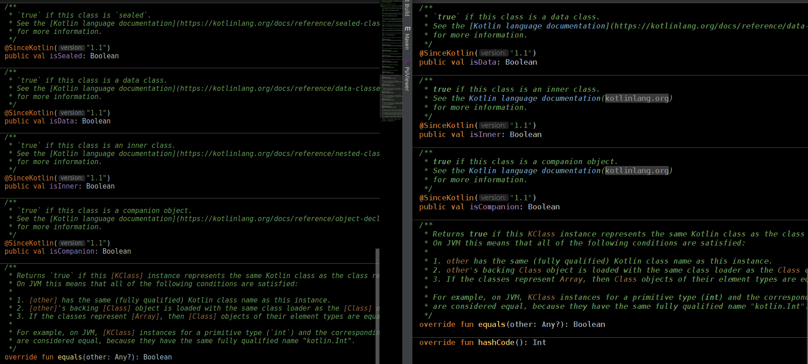

<h2>KDoc Clean Read plugin for IntelliJ platform IDEs.</h2>

Making KDoc (Kotlin) comments more readable by:
  <ul>
    <li> Text styles for value of tags:  
      <ul>
        <li> `<code>code</code>` and "&nbsp;&nbsp;&nbsp;&nbsp;<code>code</code>"  
        <li> _<i>regular emphasis</i>_ *<i>regular emphasis</i>*  
        <li> __<b>strong emphasis</b>__ **<b>strong emphasis</b>**  
        <li> [<a>link name</a>](http://...)
      </ul>
    <li> Hiding(folding) brackets at some markdown tags:
      <ul>
        <li> `code` -> code ;
        <li> _emphasis_ -> emphasis ;
        <li> **emphasis** -> emphasis ;
        <li> [link] -> link ;
        <li> [my github](http://github.com/ArtsiomCh) -> my github(github.com)
      </ul>
    <li> Tag and tag's value text styles are customisable at:
        Settings -> Editor -> Color Scheme -> KDoc Clean Read.
  </ul>

Plugin is based on <a href="https://plugins.jetbrains.com/plugin/10828-javadoc-clean-read">JavaDoc Clean Read</a>. 

Tags hiding is implemented through IntelliJ <a href="https://www.jetbrains.com/help/idea/code-folding.html">code folding</a>. So all shortcuts (Ctrl+. Ctrl+NumPad + and others) works. As well as <i>code folding toggles</i> (like <code>&#x2302;</code>) shown in the editor to the left of the corresponding multiline folding regions.         

There are some limitations for corner cases in current release: multiline tags, nested tags, simplified parsing of escaped emphasis, misbehaves of IDEA built-in KDoc parser <a href="https://youtrack.jetbrains.com/issue/KT-29952">Misbehaves of KDoc...</a>, etc. But mostly it works fine.  

## **License**

Plugin is open-source software and is licenced under GPL v3 licence.

## **Versions**
0.0.1 - Initial MVP release:
   <li> Text styles for value of markdown tags: ` ; _ and * ; __ and ** ; [link name](http...)
   <li> Hiding(folding) brackets at some markdown tags: ` ; _ and * ; __ and ** ; [link] ; [link name](http...)
   <li> Customisation at: Settings -> Editor -> Color Scheme -> KDoc Clean Read.
